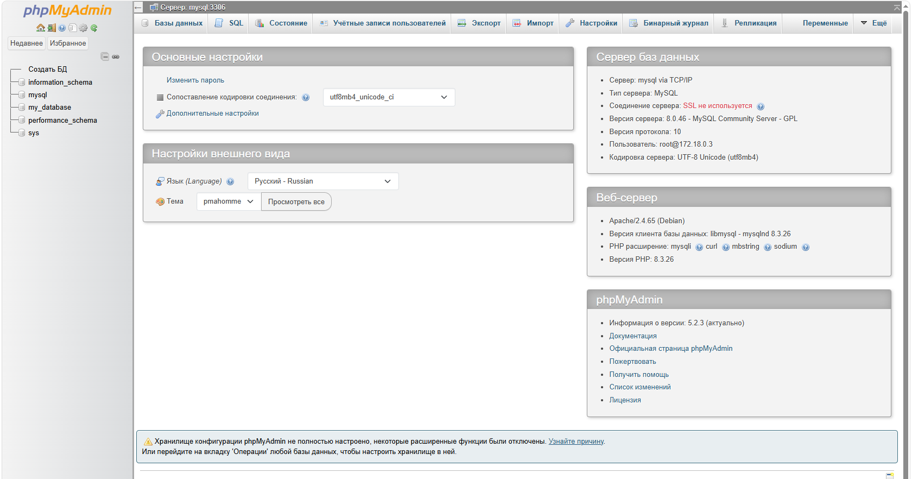

## Контейнеры MySQL + phpMyAdmin через Docker Compose

**phpMyAdmin** — веб-приложение с открытым исходным кодом, написанное на **PHP**, которое позволяет управлять базами **MySQL/MariaDB** прямо из браузера. Оно даёт наглядный интерфейс для работы с данными, избавляя от необходимости вводить **SQL**-запросы вручную.

### 1. Подготовка каталога

Прежде чем приступать, стоит проверить, не запущены ли уже другие **docker-compose** проекты:
```shell
docker compose ls
```
Их лучше остановить — так меньше вероятность конфликта за порты.

Структура проекта:
```
mysql-pma-app/
└── compose.yaml
```

```shell
mkdir -p mysql-pma-app && touch mysql-pma-app/compose.yaml && cd mysql-pma-app
```

### 2. Конфигурация композера `compose.yml`

Вариант 1
```yml
services:
  # Сервис базы данных MySQL
  mysql:
    # Официальный образ MySQL 8.0
    image: mysql:8.0
    # Автоперезапуск контейнера при остановке или падении
    restart: unless-stopped
    environment:
      # Обязательные переменные окружения MySQL
      MYSQL_ROOT_PASSWORD: root       # Пароль root-пользователя
      MYSQL_DATABASE: my_database     # База, создаваемая автоматически
      MYSQL_USER: my_user             # Дополнительный пользователь
      MYSQL_PASSWORD: my_password     # Пароль дополнительного пользователя
    ports:
      # Порт 3306 хоста → порт 3306 контейнера
      - "3306:3306"
    volumes:
      # Данные БД сохраняются в Docker-томе
      - mysql_data:/var/lib/mysql
    networks:
      - mysql-pma-network

  # Сервис phpMyAdmin
  phpmyadmin:
    # Стартует после готовности mysql
    depends_on:
      - mysql
    # Официальный образ phpMyAdmin
    image: phpmyadmin/phpmyadmin:latest
    # Порт 8083 хоста → порт 80 контейнера
    ports:
      - "8083:80"
    restart: unless-stopped
    environment:
      # Параметры подключения к серверу БД
      PMA_HOST: mysql        # Хост MySQL (имя сервиса)
      PMA_PORT: 3306         # Порт MySQL
      PMA_ARBITRARY: 1       # Разрешает подключение к любому серверу, не только mysql
      UPLOAD_LIMIT: 300M     # Лимит загрузки файлов (для крупных SQL-дампов)
    networks:
      - mysql-pma-network

# Общая сеть для связи контейнеров
networks:
  mysql-pma-network:

# Docker-том для хранения данных БД
volumes:
  mysql_data:
```

### 3. Установка и запуск

В каталоге с `compose.yaml` выполните команду для фонового запуска всех сервисов:
```shell
docker compose up -d
```
**Docker** начнёт скачивать образы и поднимать контейнеры. Это может занять несколько минут.

Параметр `-d` означает фоновый режим.

Дождитесь завершения загрузки. Проверить состояние можно командой:
```shell
docker compose ps -a
```
Оба контейнера (`mysql` и `phpmyadmin`) должны быть в статусе **Up**.

### 4. Доступ к phpMyAdmin

- phpMyAdmin: [URL: http://localhost:8083](http://localhost:8083)
- Сервер: `mysql` (или `localhost:3306`)
- Пользователь: `root`
- Пароль: `root`




### 5. Управление и полезные команды

Находясь в каталоге `mysql-pma-app`:

1. Логи **phpmyadmin** в реальном времени
```shell
docker compose logs -f phpmyadmin
```
`-f` — режим ожидания (в реальном времени)

Для выхода из просмотра логов нажмите `Ctrl+C`

2. Логи базы данных **mysql** в реальном времени
```shell
docker compose logs -f mysql
```
Для выхода нажмите `Ctrl+C`

3. Приостановить контейнер:
```shell
docker compose stop
```
4. Запустить приостановленный контейнер:
```shell
docker compose start
```
5. Перезапустить:
```shell
docker compose restart
```
6. Показать конфигурацию текущего проекта:
```shell
docker compose config
```
7. Вход в контейнер **MySQL** (имя контейнера — через `docker compose ps`)
```shell
docker compose exec mysql bash
```

Выход из контейнера — команда `exit`

### 6. Удаление проекта

Находясь в каталоге `mysql-pma-app`:

1. Остановка контейнеров проекта:
```shell
docker compose down
```
2. Остановка с полным удалением данных (БД и файлов) — опционально:
```shell
docker compose down --volumes
```
или короче:
```shell
docker compose down -v
```
(**Осторожно:** команда удалит всё, что было создано в проекте!).

> ### Для полного удаления проекта достаточно остановить его через `docker compose down` или `docker compose down --volumes`, удалить docker-образ и затем стереть каталог `mysql-pma-app`

Выходим из каталога:
```shell
cd ..
```
и удаляем:
```shell
rm -rf mysql-pma-app
```
